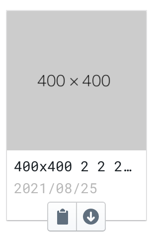

# Static assets

## Background

  

Currently, we are lacking a reliable method to serve static images.

  

The common method includes uploading to Shopify product image, Marketing’s email editor, manually upload to S3 bucket, etc.

  

## Solution

  

We need a platform/service for addressing the following problems:

  

- Easy upload and link copy

- Update assets without affecting the link (Don’t need to update code)

- Image resize, edit, stamp, etc.

- Product and project scoped assets management & access

  

Centralized platform for managing static assets including the above features.

  

## Architecture

  

### FE

  

react, vite

  

### BE

  

Golang

  

## Features preview

  

- upload

drag & drop upload, multiple uploads, rename files

[1.mp4](1.mp4)

- download / copy link

  

## Progress

  

Currently, the entire service hasn’t been deployed to any environment(Testing, Production).

  

The following to-do list are representing work status in local development.

  

### FE

  

- [x] upload

- [x] copy link & preview

- [x] file/folder navigation UI

- [ ] resize

  

### BE

  

- [x] upload & link

- [ ] access management